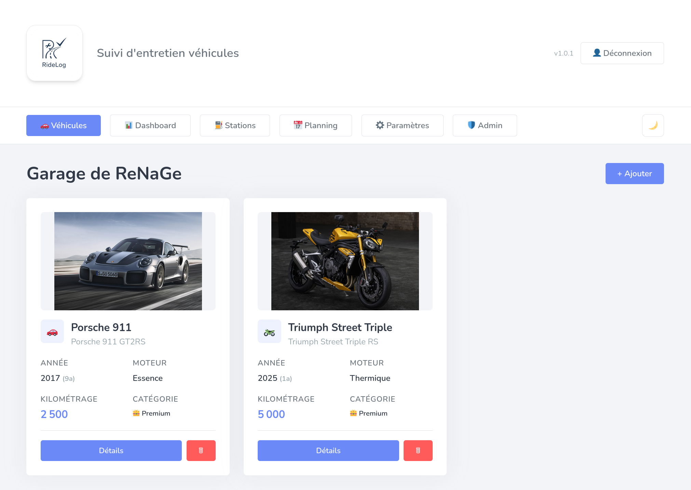
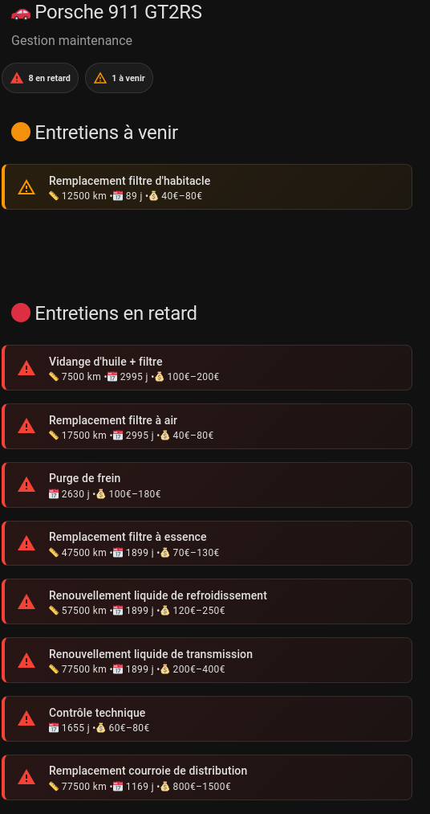

<br clear="left"/>

## Description

**RideLog** est une application self-hosted de suivi d'entretien de véhicules.
Gardez un œil sur vos kilométrages, planifiez vos maintenances, suivez votre consommation de carburant et recevez des rappels automatiques — le tout hébergé chez vous, sans dépendance cloud.

Conçu pour les particuliers passionnés comme pour les petits parcs de véhicules, RideLog supporte voitures et motos avec des plans d'entretien intelligents adaptés à chaque motorisation.

---

<p align="center">
  
</p>

---

## Fonctionnalités

- **Gestion multi-véhicules** — voitures et motos, avec photo, VIN et plaque d'immatriculation
- **Plan d'entretien intelligent** — intervalles adaptés par type, motorisation et marque, avec filtrage diesel/essence
- **Anti-drift kilométrique** — les échéances s'alignent sur des multiples propres, pas de décalage cumulatif
- **Suivi carburant** — historique des pleins, consommation L/100km, coût/km, projections annuelles
- **Recherche stations-service** — prix temps réel sur 39 202 communes françaises (données gouv.fr)
- **Rappels automatiques** — 3 paliers de notifications (à planifier, à prévoir, en retard)
- **Webhooks** — Discord
- **Intégration Home Assistant** — custom component avec capteurs par véhicule + cartes Lovelace
- **Planning** — calendrier mensuel des entretiens à venir
- **Dashboard** — statistiques agrégées du parc
- **Export** — récapitulatif en ZIP (CSV + factures)
- **Multi-utilisateurs** — inscription par invitation, rôles admin, compte de service HA
- **Mode sombre** — thème clair/sombre avec persistance

---

## Démarrage rapide

```bash
git clone https://github.com/The-ReNaGe/RideLog.git RideLog && cd RideLog
docker compose up -d --build
```

**Interface** : [http://localhost:3100](http://localhost:3100)
**API docs** : [http://localhost:8000/docs](http://localhost:8000/docs)

Le premier utilisateur créé est automatiquement admin.

---

## Configuration

### Variables d'environnement

Toutes configurables dans `docker-compose.yml` :

| Variable | Défaut | Description |
|---|---|---|
| `JWT_SECRET` | *(généré)* | Secret pour les tokens JWT — **changer en production** |
| `REGISTRATION_MODE` | `invite` | Mode d'inscription : `open`, `invite`, `closed` |
| `HA_INIT_KEY` | *(généré)* | Clé pour initialiser le compte Home Assistant |
| `RAPIDAPI_KEY` | — | Clé RapidAPI pour le décodage de plaque (optionnel) |
| `REMINDER_INTERVAL` | `3600` | Intervalle du scheduler de rappels en secondes |
| `REMINDER_ENABLED` | `true` | Active/désactive les rappels automatiques |
| `LOG_LEVEL` | `INFO` | Niveau de log (`DEBUG`, `INFO`, `WARNING`, `ERROR`) |
| `CORS_ORIGINS` | `*` | Origines CORS autorisées |

### Changer le port

Modifier la ligne `ports` du service `frontend` dans `docker-compose.yml` :

```yaml
ports:
  - "8080:80"  # Interface accessible sur le port 8080
```

---

## Stack technique

| Composant | Technologie |
|---|---|
| Backend | Python 3.11, FastAPI, SQLAlchemy, SQLite |
| Frontend | React 18, Vite 5, Tailwind CSS 3 |
| Auth | JWT HS256 (7 jours), bcrypt, rate limiting progressif |
| Conteneurs | Docker Compose (backend + nginx) |
| Données | SQLite dans `./data/ridelog.db` (volume persistant) |

---

## Entretien véhicules

### Voitures

| Entretien | Intervalle | Motorisation |
|---|---|---|
| Vidange + filtre à huile | 10 000 km / 12 mois | Toutes |
| Filtre à air | 20 000 km / 12 mois | Toutes |
| Filtre d'habitacle | 15 000 km / 12 mois | Toutes |
| Filtre à gasoil | 20 000 km / 24 mois | Diesel uniquement |
| Filtre à essence | 50 000 km / 48 mois | Essence uniquement |
| Bougies d'allumage | 30 000 km | Essence / hybride |
| Purge de frein | 24 mois | Toutes |
| Courroie de distribution | 80 000 km / 72 mois | Toutes |
| Liquide de refroidissement | 60 000 km / 48 mois | Toutes |
| Liquide de transmission | 80 000 km / 48 mois | Toutes |
| Contrôle technique | Réglementaire | Toutes |

### Motos

Les intervalles de révision sont configurés par marque et cylindrée (ex: Triumph 660cc = 16 000 km, Honda 125cc = 4 000 km). L'utilisateur peut les surcharger à la création du véhicule.

- **Révision périodique** — basée sur le kilométrage (configurable)
- **Entretien annuel** — tous les 12 mois, contrôle simplifié si le km n'est pas atteint
- **Soupapes** — toutes les 2 révisions (automatique)
- **Purge frein + embrayage** — tous les 2 ans
- **Liquide refroidissement** — tous les 3 ans
- **Révision fourche** — tous les 3 ans
- **Huile transmission** — tous les 4 ans
- **Contrôle technique** — réglementaire français (2020-2021 : 2026, 2022+ : 5ème anniversaire)

---

## Système de rappels

Le scheduler vérifie les échéances toutes les heures et envoie des notifications via les webhooks configurés :

| Palier | Condition | Niveau |
|---|---|---|
| Tier 1 | ≤ 90 jours **ou** ≤ 1 500 km | À planifier |
| Tier 2 | ≤ 30 jours **ou** ≤ 500 km | À prévoir |
| Tier 3 | Échéance dépassée | En retard |

Webhooks supportés : **Discord** (embed riche).

---

## Intégration Home Assistant

<p align="left">
  
</p>

### Installation

1. Créer le compte HA : **Paramètres → Home Assistant → Créer le compte**
2. Copier le custom component :
   ```bash
   cp -r ha-integration/custom_components/ridelog/ \
     ~/.homeassistant/custom_components/ridelog/
   ```
3. Redémarrer Home Assistant
4. Ajouter l'intégration : **Paramètres → Appareils et services → + → "RideLog"**
5. Saisir l'URL de l'API (ex: `http://192.168.1.x:8000`)

### Capteurs créés (par véhicule)

| Capteur | Contenu |
|---|---|
| `sensor.ridelog_{nom}_summary` | Kilométrage, marque, modèle, année |
| `sensor.ridelog_{nom}_upcoming` | Nombre et détail des maintenances à venir |
| `sensor.ridelog_{nom}_overdue` | Nombre et détail des maintenances en retard |

### Cartes Lovelace

Des cartes Mushroom prêtes à l'emploi sont générables depuis **Paramètres → Home Assistant → Carte Lovelace**.

Prérequis HACS : [Mushroom Cards](https://github.com/piitaya/lovelace-mushroom), [card_mod](https://github.com/thomasloven/lovelace-card-mod).

---

## Sauvegarde et restauration

```bash
# Sauvegarde
cp ./data/ridelog.db ./backup_ridelog_$(date +%Y%m%d).db

# Restauration
cp ./backup_ridelog.db ./data/ridelog.db
docker compose restart backend
```

Les données sont stockées dans `./data/` : base de données SQLite, photos et factures.

---

## API

Documentation interactive Swagger : **http://localhost:8000/docs**

### Principaux endpoints

| Méthode | Route | Description |
|---|---|---|
| `POST` | `/api/auth/login` | Connexion → JWT |
| `POST` | `/api/auth/register` | Inscription |
| `GET/POST` | `/api/vehicles` | Liste / Créer véhicule |
| `GET/PUT/DELETE` | `/api/vehicles/{id}` | Détail / Modifier / Supprimer |
| `GET/POST` | `/api/vehicles/{id}/maintenances` | Historique entretien |
| `GET` | `/api/vehicles/{id}/upcoming` | Maintenances à venir |
| `GET/POST` | `/api/vehicles/{id}/fuel-logs` | Pleins carburant |
| `GET` | `/api/vehicles/{id}/fuel-stats` | Statistiques conso |
| `GET` | `/api/fuel-stations/search` | Recherche stations |
| `GET/POST/DELETE` | `/api/webhooks/settings/webhooks` | Gestion webhooks |
| `GET` | `/api/vehicles/planning` | Planning global |
| `GET` | `/api/dashboard/stats` | Stats dashboard |

---

## Structure du projet

```
RideLog/
├── docker-compose.yml          # Orchestration des services
├── claude.md                   # Documentation technique détaillée
├── backend/
│   ├── main.py                 # Point d'entrée FastAPI
│   ├── models.py               # Modèles SQLAlchemy + migrations
│   ├── maintenance_calculator.py  # Logique métier entretien
│   ├── reminder_scheduler.py   # Scheduler rappels automatiques
│   ├── security.py             # JWT, bcrypt, rate limiting
│   ├── routes/                 # Endpoints API
│   └── data/                   # JSON config, communes CSV
├── frontend/
│   ├── src/
│   │   ├── App.jsx             # Navigation state-based
│   │   ├── pages/              # Pages principales
│   │   ├── components/         # Composants UI
│   │   └── lib/api.js          # Client Axios (~70 méthodes)
│   └── nginx.conf              # Proxy + SPA fallback
└── ha-integration/
    ├── custom_components/ridelog/  # Custom component HA
    └── templates/                  # Templates cartes Lovelace
```

Pour la documentation technique complète (comment modifier chaque comportement), voir [claude.md](claude.md).

---

## Contribuer

Les contributions sont les bienvenues ! Consulte [CONTRIBUTING.md](CONTRIBUTING.md) pour le guide complet.

```bash
# Fork → Clone → Branch → PR
git clone https://github.com/The-ReNaGe/RideLog.git
cd RideLog
git checkout -b feat/ma-feature
docker compose up -d --build
# ... code, test, commit, push, ouvre une PR
```

---

## Stack technique

| Composant | Technologie |
|---|---|
| Backend | Python 3.11, FastAPI, SQLAlchemy, SQLite |
| Frontend | React 18, Vite 5, Tailwind CSS 3 |
| Auth | JWT HS256 (7 jours), bcrypt, rate limiting progressif |
| Conteneurs | Docker Compose (backend + nginx) |
| Données | SQLite dans `./data/ridelog.db` (volume persistant) |
| Version | RideLog v1.4.0

---

## Licence

Ce projet est sous licence [AGPL-3.0](LICENSE).
