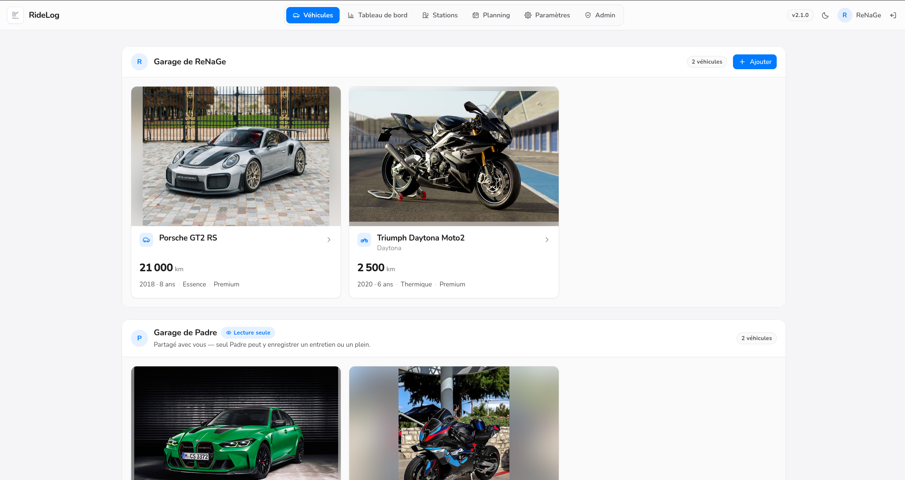
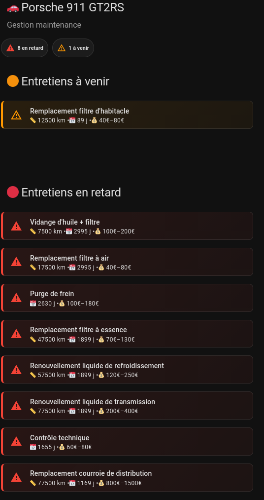

<br clear="left"/>

<p align="right"><strong>English</strong> · <a href="README.fr.md">Français</a></p>

## Description

**RideLog** is a self-hosted vehicle maintenance tracker.
Keep an eye on your mileage, plan your servicing, track fuel consumption and get automatic reminders — all hosted on your own hardware, with no cloud dependency.

Built for enthusiasts and small fleets alike, RideLog handles both cars and motorcycles with maintenance schedules tailored to each engine type.

> **Note on language.** The user interface is currently in French only. This
> README is the English entry point; translating the interface is planned work,
> not something already done.

---

<p align="center">
  
</p>

---

## Features

- **Multi-vehicle management** — cars and motorcycles, with photo, VIN and licence plate
- **Smart maintenance schedule** — intervals adapted to vehicle type, engine and brand, with diesel/petrol filtering
- **Mileage anti-drift** — due dates snap to clean multiples, so late servicing never shifts the whole schedule
- **Per-vehicle adjustable plan** — custom intervals, items set aside when they don't apply to the machine, and your own recurring items with the interval you choose
- **Fuel tracking** — refuelling history, L/100 km consumption, cost per km, yearly projections
- **Filling station search** — real-time prices across 39,202 French communes (data from gouv.fr)
- **Automatic reminders** — 3 notification tiers (to plan, coming up, overdue)
- **Webhooks** — Discord
- **Home Assistant integration** — custom component with per-vehicle sensors and Lovelace cards
- **Planning** — monthly calendar of upcoming servicing
- **Dashboard** — aggregated fleet statistics
- **Export** — ZIP summary (CSV + invoices)
- **Multi-user** — invitation-based registration, admin roles, HA service account
- **Household groups** — share your vehicles with your household, read-only, by invitation (vehicles can be kept private)
- **Dark mode** — light/dark theme with persistence

---

## Quick start

```bash
git clone https://github.com/The-ReNaGe/RideLog.git RideLog && cd RideLog
```

**Before starting the containers, create your configuration file:**

```bash
cp .env.example .env
```

Open `.env` and fill in at least:
- `JWT_SECRET` — JWT signing secret (`openssl rand -hex 32`)
- `HA_INIT_KEY` — key used to initialise the Home Assistant account (`openssl rand -hex 16`)

Then start it:

```bash
docker compose pull
docker compose up -d
```

Images are pulled from the GitHub Container Registry — there is nothing left to
build. Expect a few dozen seconds instead of several minutes.

**Web interface**: [http://localhost:3100](http://localhost:3100)

The first account created automatically becomes an admin.
The API documentation is available from the interface: **Settings → API Documentation**.

---

## Configuration

All configuration lives in the `.env` file (created from `.env.example`).
`.env` is never committed — it stays on your machine only.

```bash
cp .env.example .env   # once, at install time
```

| Variable | Default | Description |
|---|---|---|
| `JWT_SECRET` | *(must be set)* | Secret for JWT tokens — **required** |
| `HA_INIT_KEY` | *(must be set)* | Key to initialise the Home Assistant account — **required** |
| `REGISTRATION_MODE` | `invite` | Registration mode: `open`, `invite`, `closed` |
| `RAPIDAPI_KEY` | — | RapidAPI key for licence-plate decoding (optional) |
| `REMINDER_INTERVAL` | `3600` | Reminder scheduler interval, in seconds |
| `REMINDER_ENABLED` | `true` | Enables or disables automatic reminders |
| `LOG_LEVEL` | `INFO` | Log level (`DEBUG`, `INFO`, `WARNING`, `ERROR`) |
| `CORS_ORIGINS` | *(empty)* | Allowed CORS origins. Leave empty for a standard deployment |
| `RIDELOG_TAG` | `stable` | Update channel — see below |

### Choosing an update channel

`RIDELOG_TAG` in `.env` decides which image is pulled:

| Value | Contents | Who it's for |
|---|---|---|
| `stable` | Hand-validated release | **Recommended.** The channel you can stay on without surprises |
| `latest` | Rebuilt on every change to the project | People who want new features early and accept the risk |
| `1.9.0` | One exact, frozen version | People who want to control precisely when things change |

> ⚠️ `latest` does **not** mean "the latest stable release". It is the most
> recent code, unvalidated. If you are unsure, keep `stable`.

**Published architectures**: `linux/amd64` and `linux/arm64` (64-bit Raspberry
Pi, ARM NAS). A single tag works everywhere — Docker picks the image matching
your machine. On any other architecture, see
[Building from source](#building-from-source).

### Changing the port

Edit the `ports` line of the `frontend` service in `docker-compose.yml`:

```yaml
ports:
  - "8080:80"  # Interface reachable on port 8080
```

---

## Tech stack

| Component | Technology |
|---|---|
| Backend | Python 3.11, FastAPI, SQLAlchemy, SQLite |
| Frontend | React 18, Vite 5, Tailwind CSS 3 |
| Auth | JWT HS256 (7 days), bcrypt, progressive rate limiting |
| Containers | Docker Compose (backend + nginx) |
| Data | SQLite in `./data/ridelog.db` (persistent volume) |

---

## Maintenance schedules

### Cars

| Service | Interval | Engine |
|---|---|---|
| Oil change + oil filter | 10,000 km / 12 months | All |
| Air filter | 20,000 km / 12 months | All |
| Cabin filter | 15,000 km / 12 months | All |
| Fuel filter (diesel) | 20,000 km / 24 months | Diesel only |
| Fuel filter (petrol) | 50,000 km / 48 months | Petrol only |
| Spark plugs | 30,000 km | Petrol / hybrid |
| Brake fluid flush | 24 months | All |
| Timing belt | 80,000 km / 72 months | All |
| Coolant | 60,000 km / 48 months | All |
| Transmission fluid | 80,000 km / 48 months | All |
| Roadworthiness test | Statutory | All |

### Motorcycles

Service intervals are configured per brand and engine displacement (for example
Triumph 660 cc = 16,000 km, Honda 125 cc = 4,000 km). You can override them when
creating the vehicle.

Every due date stays adjustable afterwards, from the vehicle's "Upcoming" tab:
change an interval, set aside a service that doesn't apply to the machine (an
air-cooled bike has no coolant), or add a recurring item missing from the
catalogue with the interval you want — a brake-pad check every 500 km, for
instance. Items set aside stay listed at the bottom of the tab and come back
with one click.

- **Periodic service** — mileage-based (configurable)
- **Annual service** — every 12 months, a simplified check when the mileage isn't reached
- **Valve clearance** — every 2 services (automatic)
- **Brake and clutch fluid** — every 2 years
- **Coolant** — every 3 years
- **Fork service** — every 3 years
- **Transmission oil** — every 4 years
- **Roadworthiness test** — French statutory rules (2020–2021: 2026; 2022+: fifth anniversary)

---

## Reminder system

The scheduler checks due dates every hour and sends notifications through the
configured webhooks:

| Tier | Condition | Level |
|---|---|---|
| Tier 1 | ≤ 90 days **or** ≤ 1,500 km | To plan |
| Tier 2 | ≤ 30 days **or** ≤ 500 km | Coming up |
| Tier 3 | Past due | Overdue |

Supported webhooks: **Discord** (rich embed).

---

## Home Assistant integration

<p align="left">
  
</p>

### Installation

1. Create the HA account: **Settings → Home Assistant → Create the account**
2. Copy the custom component:
   ```bash
   cp -r ha-integration/custom_components/ridelog/ \
     ~/.homeassistant/custom_components/ridelog/
   ```
3. Restart Home Assistant
4. Add the integration: **Settings → Devices & Services → + → "RideLog"**
5. Enter the API URL (e.g. `http://192.168.1.x:8000`)

### Sensors created (per vehicle)

| Sensor | Contents |
|---|---|
| `sensor.ridelog_{name}_summary` | Mileage, brand, model, year |
| `sensor.ridelog_{name}_upcoming` | Count and details of upcoming servicing |
| `sensor.ridelog_{name}_overdue` | Count and details of overdue servicing |

### Lovelace cards

Ready-to-use Mushroom cards can be generated from **Settings → Home Assistant →
Lovelace card**.

HACS prerequisites: [Mushroom Cards](https://github.com/piitaya/lovelace-mushroom),
[card_mod](https://github.com/thomasloven/lovelace-card-mod).

---

## Updating

```bash
cd RideLog
git pull origin main
docker compose pull
docker compose up -d
```

Database migrations are applied automatically when the backend restarts, after a
backup has been written to `./data/backups/`.

> ⚠️ **First update from a version that had no `.env`**: create the file before
> starting, otherwise the backend will refuse to boot.
> ```bash
> cp .env.example .env
> # Fill in JWT_SECRET and HA_INIT_KEY in .env
> ```

---

## ⚠️ Migrating from a version older than 2.0

**As of 2.0, RideLog is no longer built on your machine: it is downloaded.**
Images are published to the GitHub Container Registry.

### Why this changed

`python:3.11-slim` and `node:18-alpine` are **moving tags**: they are rebuilt
upstream on a regular basis. Two people installing "the same version" of RideLog
two weeks apart did not end up with the same image. A bug that appeared for only
one of them became impossible to diagnose — there was no way to tell whether the
difference came from the code or from the base image.

An image published once fixes the contents: everyone runs exactly the same bytes.

### The migration in practice

```bash
cd RideLog
git pull origin main
```

> ⚠️ **`git pull` refuses with "your local changes would be overwritten"**: this
> is common if you had hand-edited `docker-compose.yml` under the old
> build-locally model (hard-coded port, `container_name`, and so on). Check what
> was changed first — most of these settings are now driven by `.env`
> (`BACKEND_PORT`, `FRONTEND_PORT`, `RIDELOG_TAG`) and no longer need editing in
> the compose file:
> ```bash
> git diff docker-compose.yml
> ```
> If the diff only contains that kind of setting, the old file can be dropped
> without losing anything (no data lives in it):
> ```bash
> git checkout -- docker-compose.yml
> git pull origin main
> ```
> Otherwise, stash it so nothing is lost and merge by hand:
> ```bash
> git stash push -- docker-compose.yml
> git pull origin main
> git stash pop
> ```

```bash
# 1. Set the channel you want (stable is the default)
grep -q '^RIDELOG_TAG=' .env || echo 'RIDELOG_TAG=stable' >> .env

# 2. Pull the images
docker compose pull

# 3. Restart
docker compose up -d

# 4. (optional) reclaim the space used by the old locally built images
docker image prune
```

Your data is untouched: it lives in `./data/`, outside the images. The backend
applies its migrations on startup, after taking a backup.

### What changes for you

| | Before | After |
|---|---|---|
| Updating | `docker compose up -d --build` | `docker compose pull && docker compose up -d` |
| Duration | several minutes | a few dozen seconds |
| Reproducibility | depends on the build date | identical for everyone |
| Local code changes | taken into account | **ignored** — see below |

### If you modify the code

A locally modified file no longer has any effect: you are running a downloaded
image. To get the old behaviour back:

```bash
docker compose -f docker-compose.yml -f docker-compose.dev.yml up -d --build
```

### Building from source

That same override file covers any architecture not served by the published
images (`linux/amd64` and `linux/arm64`) — a Raspberry Pi running a 32-bit
system, for instance:

```bash
docker compose -f docker-compose.yml -f docker-compose.dev.yml up -d --build
```

### Rolling back

To go back to an earlier version, **two things must roll back together**:

```bash
# 1. the image
RIDELOG_TAG=1.9.0   # in .env
docker compose pull && docker compose up -d
```

```bash
# 2. the database, IF the newer version had migrated the schema
docker compose stop backend
cp ./data/backups/ridelog-<timestamp>.db ./data/ridelog.db
docker compose start backend
```

> If you restore only the image, **the backend will refuse to start**. That is
> not a fault: it is a safeguard. A database migrated by a newer version holds a
> schema the older one cannot read, and letting it write there would corrupt your
> data. The log message states the schema version it expected.

---

## Backup and restore

**Automatic backups**: the backend writes a copy of the database to
`./data/backups/` before any schema migration, and keeps the 5 most recent
(`DB_BACKUP_KEEP`). That copy is what you restore to go back to an earlier
version.

```bash
# Manual backup — stop the backend first, a hot copy can catch the file
# in the middle of a write
docker compose stop backend
cp ./data/ridelog.db ./backup_ridelog_$(date +%Y%m%d).db
docker compose start backend

# Restore
docker compose stop backend
cp ./backup_ridelog.db ./data/ridelog.db
docker compose start backend
```

Data is stored in `./data/`: SQLite database, backups, photos and invoices.
Nothing lives inside the images.

---

## API

Full API documentation is available from the interface: **Settings → API
Documentation**.

### Main endpoints

| Method | Route | Description |
|---|---|---|
| `POST` | `/api/auth/login` | Sign in → JWT |
| `POST` | `/api/auth/register` | Sign up |
| `GET/POST` | `/api/vehicles` | List / create a vehicle |
| `GET/PUT/DELETE` | `/api/vehicles/{id}` | Detail / update / delete |
| `GET/POST` | `/api/vehicles/{id}/maintenances` | Service history |
| `GET` | `/api/vehicles/{id}/upcoming` | Upcoming servicing |
| `GET/POST` | `/api/vehicles/{id}/fuel-logs` | Fuel entries |
| `GET` | `/api/vehicles/{id}/fuel-stats` | Consumption statistics |
| `GET` | `/api/fuel-stations/search` | Filling station search |
| `GET/POST/DELETE` | `/api/settings/webhooks` | Webhook management |
| `GET` | `/api/vehicles/planning` | Global planning |
| `GET` | `/api/dashboard/stats` | Dashboard statistics |

---

## Project layout

```
RideLog/
├── docker-compose.yml          # Service orchestration
├── .env.example                # Configuration template (copy to .env)
├── CLAUDE.md                   # Detailed technical documentation (French)
├── backend/
│   ├── main.py                 # FastAPI entry point
│   ├── models.py               # SQLAlchemy models + migrations
│   ├── maintenance_calculator.py  # Maintenance business logic
│   ├── reminder_scheduler.py   # Automatic reminder scheduler
│   ├── security.py             # JWT, bcrypt, rate limiting
│   ├── routes/                 # API endpoints
│   └── data/                   # JSON config, communes CSV
├── frontend/
│   ├── src/
│   │   ├── App.jsx             # State-based navigation
│   │   ├── pages/              # Main pages
│   │   ├── components/         # UI components
│   │   └── lib/api.js          # Axios client (~70 methods)
│   └── nginx.conf              # Proxy + SPA fallback
└── ha-integration/
    ├── custom_components/ridelog/  # HA custom component
    └── templates/                  # Lovelace card templates
```

For the full technical documentation (how to change each behaviour), see
[CLAUDE.md](CLAUDE.md) — written in French.

---

## Contributing

Contributions are welcome. See [CONTRIBUTING.md](CONTRIBUTING.md) for the full
guide (written in French).

```bash
# Fork → Clone → Branch → PR
git clone https://github.com/The-ReNaGe/RideLog.git
cd RideLog
git checkout -b feat/my-feature
cp .env.example .env  # configure before starting
docker compose -f docker-compose.yml -f docker-compose.dev.yml up -d --build
# ... code, test, commit, push, open a PR
```

---

## Licence

This project is licensed under [AGPL-3.0](LICENSE).

---

<p align="right">RideLog v3.0.0</p> <!-- x-release-please-version -->
